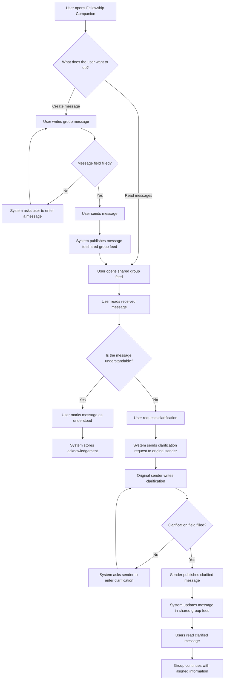

```mermaid
flowchart TD
A[User opens Fellowship Companion]
--> B{What does the user want to do?}
B -->|Create message| C[User writes group message]
C --> D{Message field filled?}
D -->|No| E[System asks user to enter a message]
E --> C
D -->|Yes| F[User sends message]
F --> G[System publishes message to shared group feed]
B -->|Read messages| H[User opens shared group feed]
G --> H
H --> I[User reads received message]
I --> J{Is the message understandable?}
J -->|Yes| K[User marks message as understood]
K --> L[System stores acknowledgement]
J -->|No| M[User requests clarification]
M --> N[System sends clarification request to original sender]
N --> O[Original sender writes clarification]
O --> P{Clarification field filled?}
P -->|No| Q[System asks sender to enter clarification]
Q --> O
P -->|Yes| R[Sender publishes clarified message]
R --> S[System updates message in shared group feed]
S --> T[Users read clarified message]
T --> U[Group continues with aligned information]
```
