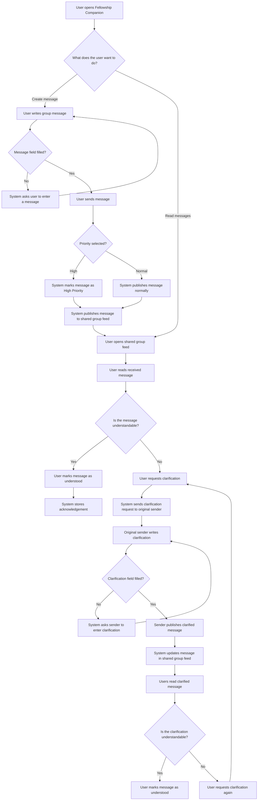

```mermaid
flowchart TD

A[User opens Fellowship Companion]
--> B{What does the user want to do?}

B -->|Create message| C[User writes group message]

C --> D{Message field filled?}

D -->|No| E[System asks user to enter a message]
E --> C

D -->|Yes| F[User sends message]

F --> G{Priority selected?}

G -->|High| H[System marks message as High Priority]
G -->|Normal| I[System publishes message normally]

H --> J[System publishes message to shared group feed]
I --> J

B -->|Read messages| K[User opens shared group feed]

J --> K

K --> L[User reads received message]

L --> M{Is the message understandable?}

M -->|Yes| N[User marks message as understood]
N --> O[System stores acknowledgement]

M -->|No| P[User requests clarification]

P --> Q[System sends clarification request to original sender]

Q --> R[Original sender writes clarification]

R --> S{Clarification field filled?}

S -->|No| T[System asks sender to enter clarification]
T --> R

S -->|Yes| U[Sender publishes clarified message]

U --> V[System updates message in shared group feed]

V --> W[Users read clarified message]

W --> X{Is the clarification understandable?}

X -->|Yes| Y[User marks message as understood]

X -->|No| Z[User requests clarification again]

Z --> P
```
